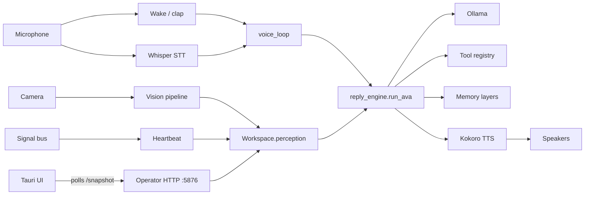

# Ava Agent v2 — Architecture

A 10-minute orientation. Each section cites files and line numbers so you can jump straight to the code.

> Reading order: § 1 → § 2 → § 4 → § 5 (the voice path is the spine of the system; every other subsystem feeds into or hangs off it).

---

## 1. System overview

Ava is a local adaptive AI companion running on a single Windows machine. Three processes:

| Process | Language | Purpose |
| --- | --- | --- |
| `avaagent.py` | Python 3.11 | Agent runtime — perception, memory, voice loop, LLM calls, TTS. Listens on `127.0.0.1:5876` (the operator HTTP API). |
| `apps/ava-control` | Tauri 2 + React 18 + Three.js | Desktop UI. Polls `/api/v1/snapshot` every 5 s and renders the orb, HUD, brain graph, tool tabs. |
| Ollama | Native | Local LLM runtime. Hosts `ava-personal:latest`, `ava-gemma4`, `gemma4:latest`, plus cloud fallbacks. |

The "agent loop" is the voice loop (§ 4). Everything else either supplies context to it (perception, memory, identity), reacts to its outputs (TTS, snapshot HUD), or runs adjacent to it on its own cadence (heartbeat, dual-brain Stream B, app discovery).



---

## 2. Process layout & shared state

`avaagent.py` is the single Python process. There is no microservice split. Subsystems share a single dict — `globals()` of `avaagent.py` — passed everywhere as `host` or `g` or `_g`. New work always lands a flag on this dict instead of inventing a new pub/sub.

Key globals you will see referenced often (search for `_g["…"]` in any file):

- `_voice_loop_state` / `_vl_state` — current voice-loop state.
- `_turn_in_progress` — True from "user transcript captured" through "TTS done".
- `_conversation_active` — broader; True from wake → entire 180 s attentive window. Background work (Stream B, curiosity engine, proactive triggers) defers while this is true.
- `_wake_source` — set by clap detector / openWakeWord callback; the wake_detector short-circuits to a positive match when present.
- `_tts_speaking` / `_last_speak_end_ts` — TTS worker stamps these; voice_loop's self-listen guard reads them.
- `_fast_llm_cache` — `{(model, num_predict): ChatOllama instance}`. Populated by the fast-path startup prewarm and reused across turns.

Module-level singletons (acquired via getter functions): `concept_graph`, `dual_brain`, `app_discoverer`, `voice_loop`, `tts_worker`, `tool_registry`. The `/api/v1/debug/full` endpoint reads these via `module._SINGLETON` getattr to avoid invoking the getters' lazy-init paths during diagnostics.

---

## 3. Startup sequence

`brain/startup.py` (`run_startup(globals())`) drives boot in two waves.

### Synchronous (blocks `avaagent.py` boot until done; ~3 minutes cold)

In order, the major steps:

1. Signal bus bootstrap — `brain/signal_bus.py:54`.
2. Identity + profile loading — reads `ava_core/IDENTITY.md`, `SOUL.md`, `USER.md`.
3. Tool registry init — `tools/tool_registry.py` scans `tools/{ava,ava_built,creative,games,system,web}/`.
4. State files initialized — paths for `ACTIVE_PERSON_PATH`, `SELF_MODEL_PATH`, etc.
5. TTS + STT engines — Kokoro pipeline load (~5 s first run), Whisper "base" load.
6. Wake-word detector + clap detector started (background daemon threads).
7. LLaVA vision check.
8. Voice loop started (background daemon thread; immediately enters `passive`).

### Background (dispatched via daemon threads; do not block boot)

- `brain/insight_face_engine.py` GPU init — first-run cudnn EXHAUSTIVE algorithm search 60-90 s, cached afterward. **The dominant cold-boot cost.**
- Concept-graph bootstrap — `brain/concept_graph.py` calls `mistral:7b` to seed initial concepts.
- Vectorstore init (Chroma at `memory/chroma.sqlite3`).
- Mem0 layer bootstrap — `brain/ava_memory.py:initialize()` (its own ChromaDB at `memory/mem0_chroma/`).
- App discoverer initial scan — `brain/app_discoverer.py:discover_all()`. Holds `self._lock` for 60-110 s while walking `C:\Program Files`, `C:\Program Files (x86)`, Start Menu, Steam, Epic.
- Self-model weekly update — `qwen2.5:14b`.
- Background tick threads.
- **Fast-path prewarm** (`avaagent.py` post-startup): 5 s after operator HTTP is up, picks the fast model via `_pick_fast_model_fallback()`, instantiates `ChatOllama`, runs a one-token invoke through the Ollama lock, stashes the warmed instance in `_g["_fast_llm_cache"]`. This is what makes the first real turn complete in 1-3 s instead of 12+ s.

After all this, `avaagent.py` line ~7847 starts the operator HTTP server on `127.0.0.1:5876` and enters its keep-alive `while not _ava_shutdown` loop.

A second-import gotcha: `avaagent.py` aliases itself with `sys.modules["avaagent"] = sys.modules["__main__"]` at the very top so worker threads doing `import avaagent` don't trigger a fresh execution of the script. (See commit `f99804e` for context.)

---

## 4. Voice path

### State machine — `brain/voice_loop.py`

`STATES = ("passive", "attentive", "listening", "thinking", "speaking")` (line 120).

| State | Duration | Exits to |
| --- | --- | --- |
| `passive` | until wake | `listening` (wake fired) |
| `attentive` | up to 180 s (`_ATTENTIVE_BASE_SECONDS`, line 71); 30 s silence-exit (`_ATTENTIVE_SILENCE_EXIT_SECONDS`, line 72) if user disengaged | `listening` (speech ≥ 1.0 s) → `passive` (timeout) |
| `listening` | `listen_session(max=12 s, silence=2.5 s)` | `thinking` (transcript captured) → `passive` (no speech) |
| `thinking` | `run_ava` runtime | `speaking` (reply produced) → `passive` (empty reply) |
| `speaking` | TTS playback | `attentive` (always) |

Wake sources fire flags directly on `_g` rather than calling state setters — voice_loop polls `_voice_loop_wake_requested` / `_wake_word_detected` at the top of `_attentive_wait()` (line 254) and `_passive_wait()` (line 233). Clap detector and openWakeWord both set these.

Self-listen guard — `_should_drop_self_listen()` (line 240): returns True if `_tts_speaking` is True OR `(now − _last_speak_end_ts) < 0.2 s`. Gates the attentive-state `listen_session` call so Whisper never transcribes Ava's own voice as user input.

### STT — `brain/stt_engine.py`

`faster_whisper.WhisperModel("base")` on CUDA float16, CPU int8 fallback. `listen_session(max_seconds, silence_seconds)` records via Silero VAD, writes WAV, calls `model.transcribe(language="en", initial_prompt="Ava, hey Ava,", hotwords="Ava")`. Returns `{text, confidence, duration_seconds, speech_detected}`. Eva→Ava normalization (`_normalize_transcript`) catches Whisper mishearings.

### Reply engine — `brain/reply_engine.py`

`run_ava(user_input, image, active_person_id)` (line 71) is the single entry point. Two paths:

- **Fast path** — gated by `_is_simple_question()` (line 45) which checks `_SIMPLE_PATTERNS` (line 26-42) and `len(words) ≤ 15`. Patterns include greetings, mood checks, time/date queries, "tell me a joke", "thanks", "ok ava". The path skips workspace tick, episodic search, concept graph, vector retrieval, dual-brain handoff, privacy scan. Fast-path uses a cached `ChatOllama` instance from `_fast_llm_cache`, with `num_predict=80` and the `ava-personal:latest` model. Target: 1.5-3 s.
- **Deep path** — full `build_prompt()` + episodic + concept graph + vector recall + dual-brain handoff + tool execution. Calls `finalize_ava_turn()` at end (`brain/turn_handler.py`).

Both paths set `_g["_inner_state_line"]` to "thinking — fast path" / "thinking — full path" so the UI can show what Ava is doing.

### Voice command router — `brain/voice_commands.py`

Runs **before** `run_ava`. 45 built-in regex patterns (line 56+) match things like "what time is it", "open spotify", "set a reminder for…". On a hit, the handler runs synchronously, calls `_say(g, response)` to enqueue TTS, persists the turn to `chat_history.jsonl`, and returns without invoking the LLM. Custom commands from `state/custom_commands.json` are checked after built-ins.

This is why `time_query` and `date_query` regression tests resolve in ~0.4 s — they never hit Ollama.

### TTS — `brain/tts_worker.py`

Kokoro neural TTS in a `THREAD_PRIORITY_HIGHEST` worker thread, COM-isolated. `speak_with_emotion(text, emotion, intensity, blocking)` enqueues; the worker pulls items, synthesizes via `KPipeline`, plays through `sd.OutputStream` chunked at 2048 samples (~85 ms @ 24 kHz). The only conditions that abort playback mid-stream: `_g["_tts_muted"] = True` or worker shutdown. Window focus changes / other apps grabbing audio are ignored.

While speaking, the worker stamps `_g["_conversation_active"] = True` so background work defers; on exit it stamps `_g["_last_speak_end_ts"] = time.time()`.

---

## 5. Dual brain — `brain/dual_brain.py`

| | Stream A (foreground) | Stream B (background) |
| --- | --- | --- |
| Model | `ava-gemma4` preferred (line 43), fallback `ava-personal:latest` (line 44). In practice the fast path uses `ava-personal` first because gemma4 emits "Thinking…" reasoning that doesn't fit `num_predict=80`. | Local `gemma4:latest` (line 48), cloud `kimi-k2.6:cloud` (line 49), fallback `qwen2.5:14b` (line 50). |
| Thread | None — runs inline on the voice_loop "thinking" thread. Marks itself busy via `foreground_busy` flag. | Daemon thread `ava-stream-b`, started by `start()` (line 86). |
| Queue | n/a | `queue.Queue(maxsize=5)` of `BrainTask` objects (line 62). |
| Triggered by | Every user turn (run_ava). | `submit(task_type, topic, payload)` from anywhere. |

`should_pause_background()` (line 208-219) — Stream B's worker checks this on every queue pop and skips the task if any of:

- `_turn_in_progress` is True
- `_conversation_active` is True
- `is_zeke_active()` returns True (recent interaction or foreground busy)
- `_dual_brain_pause_until_ts` is in the future

Background insight handoff (`handoff_insight_to_foreground()`, line 126-163): after a Stream B task completes, if the result is `"worth_sharing"`, the dict is stored on `_background_insight` along with relevance keywords. On the next user turn, if any keyword overlaps the user's input, the insight is woven into the reply.

---

## 6. Ollama lock — `brain/ollama_lock.py`

`_OLLAMA_LOCK = threading.RLock()` (line 36). Reentrant so a tool call invoked mid-inference can itself call out to Ollama on the same thread without deadlocking.

Pattern (line 17-18 docstring):

```python
from brain.ollama_lock import with_ollama
result = with_ollama(lambda: llm.invoke(messages), label="reply_engine")
```

Trace lines (`re.lock_wait_start`, `re.lock_wait_acquired waited_ms=…`, `re.lock_released`) appear in the trace ring during turns; the regression battery parses these into the `ollama_lock_wait_ms_total` field.

Import sites: `brain/reply_engine.py` (every LLM invoke in fast and deep paths), `brain/dual_brain.py` (Stream B inference + model resolution), `brain/proactive_triggers.py` (proactive checks), `avaagent.py` (the fast-path prewarm).

The lock prevents Stream A and Stream B from competing for VRAM at the same time, which on an RTX 5060 would cause 30 s+ model swaps.

---

## 7. Memory layers

Several layers, each with a distinct role and backend:

| Layer | Module | Backend | Read/written when |
| --- | --- | --- | --- |
| Vector memory | `brain/memory.py` (helper fns) + Chroma | `memory/chroma.sqlite3` (langchain-chroma) | `remember_with_context()` after each turn; `recall_for_person()` from `prompt_builder`. |
| Mem0 facts | `brain/ava_memory.py` | `memory/mem0_chroma/` (mem0 + Ollama `nomic-embed-text:latest` embedder) | Bootstrap in background at startup; `add_conversation_turn()` after each Ava reply. Has `_init_error` sentinel — on init failure, falls back to `available=False` without retry-looping. |
| Episodic | `brain/episodic_memory.py` | `state/episodic_memory.json` | Event-driven; visual or behavioural moments. |
| Visual | `brain/visual_memory.py` | local JSON cluster file | Cluster summary cached at startup; clusters update on visual events. |
| Concept graph | `brain/concept_graph.py` | `state/concept_graph.json` | Nodes + edges. `add_node()`, `add_edge()`, `activate_node()` mutate; `_save()` persists. **Has exponential backoff** (1, 2, 4, 8, 16, 32, 60 s capped) on WinError 5/32 lock conflicts so a tight bootstrap loop doesn't flood retries. |
| Working memory | `brain/workspace.py` (Workspace.state.perception) | in-memory PerceptionState | Rebuilt every turn; readers via `_g["workspace"]`. |
| File-based reflection | `state/learning_log.jsonl`, `state/reflections/` | newline-delimited JSON | Written by `brain/reflection.py`, `brain/learning_tracker.py`. |

`brain/memory_bridge.py` shims older callers; `brain/memory_consolidation.py` runs periodic dedupe/scoring across vector memory.

---

## 8. Tool registry — `tools/tool_registry.py`

Tools self-register on import via `register_tool(name, description, tier, handler)`. Directory layout:

```
tools/
├── ava/         # Ava-specific tools
├── ava_built/   # tools Ava built herself (custom)
├── creative/    # image gen, music, …
├── dev/         # development/debug helpers (dump_debug, regression_test, …)
├── games/       # game integrations
├── system/      # OS-level (open app, set reminder, clipboard)
├── web/         # web fetch, scrape, search
└── tool_registry.py
```

Hot-reload: a `_FileWatcher` daemon polls `tools/` every 5 s (`_POLL_INTERVAL`); modified `.py` files are re-imported and the registry updated without restarting Ava.

`tier` is an integer on the `ToolDef` (low = essential, mid = common, high = experimental/dangerous). The Tier 3 approval flow (`_desktop_tier3_approved`, `voice_commands.py` "yes do it" pattern) gates risky operations on explicit user assent.

---

## 9. Vision pipeline

Single capture thread, multiple downstream consumers.

- **Capture** — `brain/background_ticks.py` `_video_frame_capture_thread()` runs `cv2.VideoCapture` at 15 fps, feeds frames to `CameraManager` (`brain/camera.py`).
- **InsightFace** — `brain/insight_face_engine.py` (buffalo_l on CUDA — RetinaFace + ArcFace, ~41 ms steady-state). Runs on every Nth frame (`_insight_every_n = 3`, ~5 fps). Returns bounding boxes, landmarks, age, gender, 3D head pose. Similarity threshold 0.45 for face recognition (line 25).
- **Expression** — `brain/expression_detector.py` MediaPipe Face Mesh (468 landmarks, geometric ratios — no ML inference). Returns dominant emotion: smile, frown, raised_eyebrows, mouth_open, etc.
- **Eye tracker** — `brain/eye_tracker.py` MediaPipe iris (landmarks 468-477) + 9-point tkinter calibration. Maps iris position to 3×3 screen regions (`top_left`, `center`, …, `bottom_right`). Calibration at `state/gaze_calibration.json`.
- **LLaVA** (optional) — `brain/scene_understanding.py`. Vision-language model invoked on demand for scene description. Availability checked at startup.

CUDA setup: ORT 1.25.1 needs CUDA 12 runtime DLLs from pip packages (`nvidia-cublas-cu12`, etc.). `brain/insight_face_engine._add_cuda_paths()` registers each `site-packages/nvidia/*/bin/` with `os.add_dll_directory` BEFORE the ORT import.

---

## 10. Heartbeat & background ticks

`brain/heartbeat.py` (904 lines) — lightweight background continuity between perception ticks. Runs every 30 s (`_HB_INTERVAL` in `brain/background_ticks.py`). Modes (line 44-50): idle (55 s gap), active (14 s), conversation (7 s), maintenance (18 s), learning_review (280 s), quiet recovery (65 s).

The heartbeat updates `_heartbeat_last_mode`, `_heartbeat_last_summary`, `_heartbeat_last_tick_id`, `_heartbeat_last_ts` on globals, which the snapshot reads. **Does not** rewrite `IDENTITY.md` / `SOUL.md` / `USER.md` — those are read-only.

Companion daemons running on their own cadences: app discoverer (initial scan + periodic refresh, paused while `_turn_in_progress`), perception pipeline tick, video capture (15 fps), Stream B worker.

---

## 11. Signal bus — `brain/signal_bus.py`

Lightweight event ring (line 71-107). Events (line 31-57):

- Vision: `SIGNAL_FACE_APPEARED`, `SIGNAL_FACE_LOST`, `SIGNAL_EXPRESSION_CHANGED`, `SIGNAL_ATTENTION_CHANGED`.
- Desktop: `SIGNAL_APP_OPENED`, `SIGNAL_APP_CLOSED`, `SIGNAL_ACTIVE_WINDOW_CHANGED`, `SIGNAL_SCREEN_IDLE`, `SIGNAL_SCREEN_ACTIVE`.
- Audio: `SIGNAL_VOICE_DETECTED`, `SIGNAL_CLAP_DETECTED`.
- System: `SIGNAL_REMINDER_DUE`, `SIGNAL_BATTERY_LOW`, `SIGNAL_NETWORK_CHANGED`.
- Clipboard: `SIGNAL_CLIPBOARD_CHANGED`.

`fire(signal, payload)` is O(1) — appends to ring. Only signals tagged URGENT (e.g. `SIGNAL_REMINDER_DUE`) dispatch handlers immediately; everything else waits for the heartbeat to `consume()` / `peek()` next tick. This is the "zero-poll architecture" — Win32 hooks fire signals only on real changes; nothing iterates a clipboard or window list on a timer.

---

## 12. Operator HTTP server — `brain/operator_server.py`

FastAPI app on `127.0.0.1:5876`. **68 endpoints** (`@app.get`/`@app.post`). Started in a background daemon thread by `start_operator_http_background()`.

The Tauri UI is the only consumer in normal use. Highlights:

- `GET /api/v1/health` — liveness ping.
- `GET /api/v1/snapshot` — the big one. Polled every 5 s by the UI. `build_snapshot(host)` (line 236) assembles ribbon (heartbeat_mode, voice_turn_state, presence_mode, …), heartbeat block, models block (selected_model, fallback, routing reason), mood, vision, voice_loop, speech, etc.
- `GET /api/v1/brain/graph` — concept-graph nodes + edges for the 3D force-graph in the Brain tab.
- `POST /api/v1/chat` — text-input chat (Tauri input row).
- `POST /api/v1/tts/toggle`, `POST /api/v1/tts/speak`, `GET /api/v1/tts/state` — TTS controls.
- `POST /api/v1/stt/listen`, `GET /api/v1/stt/result` — manual STT trigger.
- `GET /api/v1/discovered_apps`, `GET /api/v1/tools/list`, `GET /api/v1/memory/mem0`, `POST /api/v1/memory/mem0/search` — read accessors for the various subsystems.
- `POST /api/v1/shutdown` — graceful exit.

**Debug endpoints (added overnight):**

- `GET /api/v1/debug/full` (commit `41dce1d`) — unified diagnostic. Pulls server time, voice_loop state, `last_turn` timing, last 100 trace lines, last 200 log lines, last 50 errors, dual_brain state, subsystem health, ribbon/heartbeat summary, concept_graph counts, app_discovery state, ui_state. **Strictly non-blocking** — reads `_SINGLETON` directly, never invokes singleton getters that could acquire locks during scans.
- `POST /api/v1/debug/inject_transcript` (commit `96665ea`, gated by `AVA_DEBUG=1`) — bypasses microphone, drives a synthetic transcript through `run_ava`, returns `{reply_text, total_ms, run_ava_ms, trace_lines_for_turn, errors_during_turn, …}`. Used by `tools/dev/regression_test.py`.

In-memory rings backing the debug endpoint: `brain/debug_state.py` installs a stdout/stderr Tee at the very top of `avaagent.py`. `_LOG_RING` (deque(maxlen=200)), `_TRACE_RING` (lines starting `[trace]`, maxlen=100), `_ERROR_RING` (auto-extracted from stderr tracebacks, maxlen=50), `_LAST_TURN` (set explicitly by `inject_transcript`).

---

## 13. Identity files — `ava_core/`

Three files, all read-only by user rule (do **not** edit them programmatically):

- **`IDENTITY.md`** — basic profile: name (Ava), creature type, creator (Zeke), purpose, vibe, emoji, avatar path. Rarely changes.
- **`SOUL.md`** — behavioural definition: warm, observant, caring; core values (honesty, action, learn); boundaries (privacy, no half-baked external replies). Evolves slowly.
- **`USER.md`** — what Ava knows about Ezekiel: trust level, habits, preferences, relationship notes. Grows over time as Ava learns.

`brain/identity_loader.py` reads all three at startup and concatenates into `_g["_AVA_IDENTITY_BLOCK"]`, which `prompt_builder` injects as the first system message on every turn. There is a written-but-disabled action block format (`IDENTITY action: update file=USER.md content=…`) that previously let Ava propose updates to USER.md; the user has gated this off by rule.

---

## Where to look first when something is broken

| Symptom | First check | Then |
| --- | --- | --- |
| Voice doesn't respond | `tools/dev/dump_debug.py` → `voice_loop.state` and `subsystem_health` | `recent_traces` for the last `[trace] vl.*` and `re.*` lines |
| Cold-start hang on first turn (`re.run_ava.entered` then silence) | Confirm `sys.modules["avaagent"]` aliases to `__main__` | Otherwise `import avaagent` from a worker thread will re-exec the script |
| Empty reply / "I'm here." | Check `_pick_fast_model_fallback()` order — `ava-personal:latest` should be first; `ava-gemma4` reasoning is too long for fast-path `num_predict=80` | Check `last_turn.run_ava_error` for exceptions |
| Stream B never runs | `_conversation_active` stuck True past attentive window | Look for missing `_g["_conversation_active"] = False` on `voice_loop._set_state("passive")` |
| TTS interrupts mid-sentence | Should not happen post-`a740bcc`. Check `tts_worker.stop()` log lines for "ignoring (audio protected)" | If it does, audit unguarded `sd.stop()` callers — TTS sd.stop() must be gated by `_tts_muted` |
| Concept graph "save failed" log spam | Backoff should kick in (1 → 60 s capped). If not, check `_save_consecutive_failures` reset on success | External process holding `concept_graph.json` (antivirus, OneDrive, preview pane) |
| `/api/v1/debug/full` slow | The endpoint must read singletons via `module._SINGLETON`, not via getter functions; getters can lock | Check `app_discoverer._lock` not held by a scan |
| Orb drifts on snapshot ticks | Re-check the suspected culprits: `key={text}` remount + `translateY` keyframe | DevTools `[drift-debug tick=N]` lines pinpoint which element grew |

---

## Glossary

- **Operator HTTP** — the FastAPI server on `127.0.0.1:5876`. Named "operator" because it's how an operator (the UI, or a CLI tool) talks to the running Ava.
- **Snapshot** — the JSON returned by `/api/v1/snapshot`. Single source of truth for the UI's polling render.
- **Fast path / deep path** — the two branches inside `run_ava`. Fast path = simple-question shortcut; deep path = full prompt + tools + dual-brain.
- **Wake source** — what triggered `passive → listening`. Today: clap detector, openWakeWord, or Whisper-poll fallback.
- **Attentive window** — the 180 s after Ava finishes speaking, during which she will respond to user speech without requiring another wake.
- **`_conversation_active`** — flag spanning the full turn + attentive window; suppresses Stream B and other background LLM work.
- **Tee ring** — `brain/debug_state.py` wraps `sys.stdout` / `sys.stderr` so every printed line is mirrored into capped deques. Backs `/api/v1/debug/full`.
