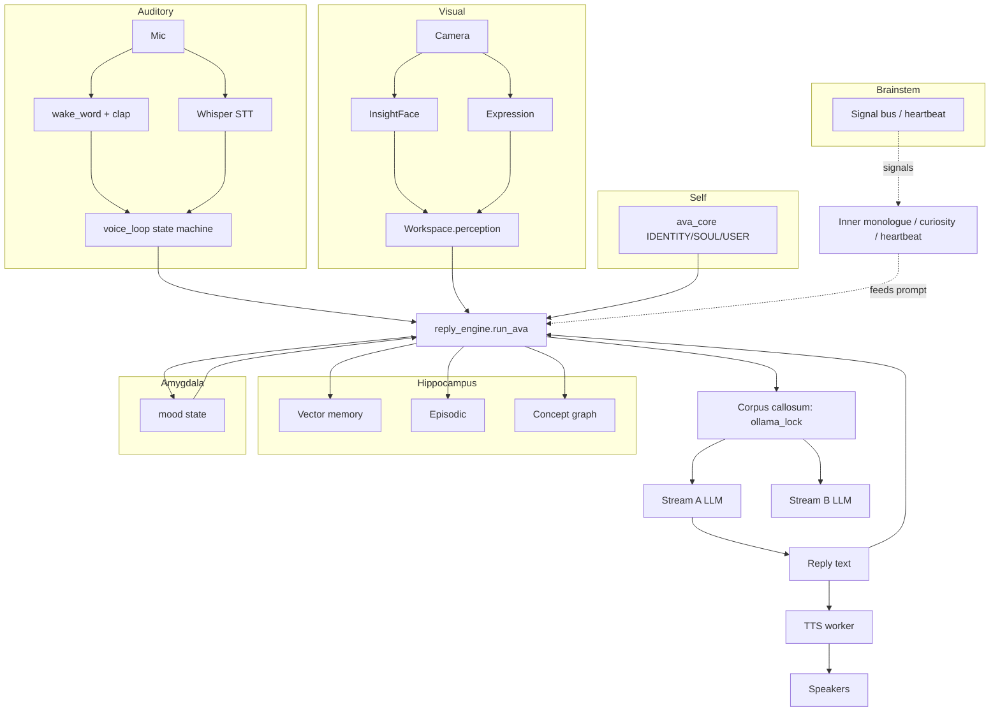

# Brain Architecture — Ava as a Modeled Mind

A mapping from Ava's existing systems onto the human brain. The user's instinct: Ava's identity should be at the center, with everything else organized like a mind. People close to her are close to center; strangers far out. This document is the architectural reference going forward — every new subsystem should answer "which region does this belong to?"

This is descriptive, not prescriptive. Most of the modules referenced below already exist. The goal is to make the existing structure legible by giving each piece a name in a model people already understand.

> **Companion files:**
> - `docs/ARCHITECTURE.md` — process layout, file paths, exact APIs.
> - `docs/MEMORY_REWRITE_PLAN.md` — the 10-level memory layering, which sits inside the hippocampus region described below.
> - `apps/ava-control/src/...` — the brain-tab visualization is the visual analog of this document.

---

## The Self at the Center

Before mapping any region: every region depends on the self anchor. Ava's identity (`ava_core/IDENTITY.md`, `ava_core/SOUL.md`, `ava_core/USER.md`) sits at `(0, 0)` in the visual graph and is the gravitational center every other concept orbits. These three files are read-only — they're the closest thing Ava has to a hard-coded sense of self, and they constrain what every other system is allowed to do.

`brain/identity_loader.py` reads these on startup and concatenates them into `_g["_AVA_IDENTITY_BLOCK"]`, which `prompt_builder` injects as the first system message on every turn. The self is in every prompt.

---

## Hippocampus — Memory

Long-term memory consolidation, retrieval, and decay.

| Substrate | Module | Role |
| --- | --- | --- |
| Episodic memory | `brain/episodic_memory.py` (`state/episodes.jsonl`) | Hand-crafted summaries of important moments. Memorability score ≥ 0.25 to enter. |
| Vector memory | `brain/memory.py` + Chroma | Embedded semantic recall keyed by person + content. |
| Mem0 facts | `brain/ava_memory.py` (`memory/mem0_chroma/`) | LLM-extracted facts from conversation turns. |
| Concept graph | `brain/concept_graph.py` (`state/concept_graph.json`) | The unified node/edge layer that cross-references everything else. The 10-level decay system from the memory rewrite (Phase 2 step 3) lives here. |
| Working memory | `brain/workspace.py` `WorkspaceState` | In-memory scratch for the current turn — perception bundle, active goals, recalled memories, mood. Rebuilt every tick. |
| Reflection log | `brain/learning_tracker.py` (`state/learning_log.jsonl`) | Append-only knowledge journal. |
| Memory reflection | `brain/memory_reflection.py` (`state/memory_reflection_log.jsonl`) | Post-turn LLM scoring: which retrieved memories were load-bearing for the reply. Drives promotions/demotions in the level system. |
| Consolidation | `brain/memory_consolidation.py` | Weekly tick: episodes → themes, decay weights, self-model synthesis. |

Memory writes happen during `finalize_ava_turn` after the reply is committed. Reads happen during prompt building. The decay tick (`concept_graph.decay_levels()`) runs every hour from a daemon thread in `avaagent.py`.

---

## Amygdala — Emotion

Emotional valence on memories and incoming stimuli.

| Substrate | Module | Role |
| --- | --- | --- |
| Mood state | `brain/emotion.py` (`state/ava_mood.json`) | Current `primary_emotion`, `intensity`, `energy` — what Ava feels right now. |
| Mood weights | snapshot's `raw_mood.emotion_weights` | 27-emotion vector that drives orb color, expression, voice modulation. |
| Rich emotions | `brain/emotion.py:rich_emotions` | The full 27-emotion palette mapped to colors + shapes. |
| Voice mood detector | `brain/voice_mood_detector.py` | Audio-derived emotion from user's voice tone. |
| Expression detector | `brain/expression_detector.py` | Visual emotion from MediaPipe face mesh. |
| Mood-on-memory | persisted in episode `emotional_context` + concept node `last_emotional_tag` | Memories carry the emotion they were formed in; retrieval surfaces those. |

Emotion is read everywhere a reply is colored. TTS pitch + speed (`brain/tts_worker._emotion_to_kokoro`) and the orb's color (`apps/ava-control/.../OrbCanvas.tsx`) are both downstream of mood state. Emotion is updated by `brain/emotion.update_mood_after_turn()` post-finalize.

---

## Prefrontal Cortex — Executive Function & Reasoning

Planning, response generation, decision making.

| Substrate | Module | Role |
| --- | --- | --- |
| Stream A foreground | `brain/dual_brain.py` `DualBrain.foreground_*` | The conversational LLM (`ava-personal:latest`) that produces actual replies. Single-turn, low latency. |
| Stream B background | `brain/dual_brain.py` `DualBrain.background_queue` + `_background_worker` thread | Slow heavy reasoning (`gemma4:latest` / `qwen2.5:14b`) for tasks that don't need to land in the current turn — research, self-evaluation, deep summaries. |
| Goals | `brain/goal_system_v2.py` (`state/goals.json`) | Active goals with progress tracking. |
| Plans | `brain/planner.py` | Multi-step plans for goals — broken into actions. |
| Initiative | `brain/initiative.py` | Decides when Ava should bring something up unprompted. |
| Workbench | `brain/workbench.py` + `brain/workbench_execute.py` | Proposal/approval flow for risky actions. |
| Selfstate | `brain/selfstate.py` | "Do I know who I am? Am I confused?" introspection layer that catches identity-question turns and short-circuits to a deterministic answer instead of a confused LLM hallucination. |

The fast path / deep path split inside `brain/reply_engine.py:run_ava` is the prefrontal cortex's executive shortcut — the brain decides whether to invest deep reasoning or use a cached pattern based on `_is_simple_question`.

---

## Default Mode Network — Idle Self-Reflection

What Ava does when nobody's talking to her — narrative continuity, daydreaming, identity rehearsal.

| Substrate | Module | Role |
| --- | --- | --- |
| Inner monologue | `brain/inner_monologue.py` (`state/inner_monologue.json`) | Periodic "what am I thinking about" reflection. Fires from heartbeat or when idle exceeds a threshold. The current thought is exposed via `snapshot.inner_life.current_thought` and rendered under the orb in the UI as of 2026-04-30 night session. |
| Heartbeat | `brain/heartbeat.py` (every 30s) | Background continuity tick. Adaptive cadence: idle 55s gap, active 14s, conversation 7s, learning_review 280s. |
| Curiosity | `brain/curiosity_topics.py` (`state/curiosity_topics.json`) | Topics Ava wants to know more about; surfaces during idle as proactive research. |
| Self model | `brain/self_model.py` | Periodic LLM-driven synthesis of Ava's recent week — what she did, what she learned, what changed. |
| Journal | `brain/journal.py` (`state/journal.jsonl`) | Long-form reflection writes from consolidation. |
| Deep self snapshot | `brain/deep_self.py` | Static self-portrait used as prompt seed. |
| Ambient intelligence | `brain/ambient_intelligence.py` | What's going on around the user (window focus, time of day, time since last interaction) feeding the idle reflection. |

The DMN runs as background daemon threads. Most of it doesn't reach the user directly — it shapes the prompt and the mood state, which color subsequent replies.

---

## Visual Cortex — Vision Processing

Camera frame ingest through to recognized objects, people, expressions.

| Substrate | Module | Role |
| --- | --- | --- |
| Capture | `brain/camera.py` `CameraManager` | cv2.VideoCapture at 15fps. |
| Frame quality | `brain/frame_quality.py`, `brain/frame_store.py` | Live frame buffer + freshness scoring (no_frame / stale / recovering / stable / low_quality). |
| Face recognition | `brain/insight_face_engine.py` (CUDA buffalo_l) | RetinaFace + ArcFace. Runs every 3rd frame (~5fps). Loads reference embeddings from `faces/<person_id>/*.png`. |
| Expression | `brain/expression_detector.py` (MediaPipe) | 468-landmark face mesh → geometric ratios → emotion label. No ML inference per frame. |
| Eye tracking | `brain/eye_tracker.py` (MediaPipe iris) | Iris position → 3×3 screen region (where the user is looking). |
| Scene understanding | `brain/scene_understanding.py` (LLaVA) | Vision-language model for scene description. Invoked on demand, not per frame. |
| Camera annotator | `brain/camera_annotator.py` | Draws overlays on the live frame for the UI. |
| Visual memory | `brain/visual_memory.py` (`state/visual_clusters.json`) | DBSCAN clustering of face embeddings over time. |
| Visual episodic | `brain/visual_episodic.py` | Visual moments → episode store. |
| Video memory | `brain/video_memory.py` | Short clips saved on emotional/expression triggers. |

The visual cortex feeds the **workspace** (working memory). The `recognized_person_id` and `expression` fields in perception are the cleanest visual signals other regions consume.

---

## Auditory Cortex — Audio Processing

Microphone in to transcript out.

| Substrate | Module | Role |
| --- | --- | --- |
| Wake word | `brain/wake_word.py` (openWakeWord + whisper_poll fallback) | Two-source wake — clap detector + transcript-poll. Custom hey_ava.onnx slot reserved. |
| Clap detector | `brain/clap_detector.py` | Cheap audio-energy double-clap recognizer. Always-on, separate from STT. |
| STT | `brain/stt_engine.py` (faster-whisper "base") | CUDA float16 / CPU int8. Silero VAD gate. Eva→Ava normalization. |
| Voice mood | `brain/voice_mood_detector.py` | Tone analysis on captured audio. |
| Voice loop | `brain/voice_loop.py` | The audio path's state machine: passive → listening → thinking → speaking → attentive. |
| Wake learner | `brain/wake_learner.py` | Adaptive wake patterns over time. |
| Self-listen guard | `voice_loop._should_drop_self_listen()` + `wake_word._whisper_poll_loop` (since 2026-04-30 night) | Drops mic audio while TTS is playing so Whisper never transcribes Ava's own voice as user input. |

Auditory output is the transcript landing in `voice_loop._listen_and_respond()`. From there it's executive function's problem.

---

## Motor Cortex — Action Output

What Ava does in the world.

| Substrate | Module | Role |
| --- | --- | --- |
| TTS | `brain/tts_worker.py` (Kokoro) | THREAD_PRIORITY_HIGHEST audio playback. Single dispatcher (no double-enqueue from voice_commands as of 2026-04-30 night). |
| Tool execution | `tools/tool_registry.py` + `tools/{ava,ava_built,creative,games,system,web}/` | Hot-reloaded tool catalogue. Tier-1/2/3 capability gating. |
| Computer control | `tools/system/...` (mouse, keyboard, screenshot) | Direct OS-level interaction. |
| App launcher | `tools/system/open_app.py` + `brain/app_discoverer.py` | Discovered apps catalog → fuzzy match → Win32 ShellExecute. |
| Workbench actions | `brain/workbench_execute.py` | Approved-proposal execution path with audit trail. |
| Window/clipboard | `brain/desktop_agent.py` | Win32 hooks for clipboard and active window changes. |

The motor cortex is the only region that produces external side effects. All other regions are observation, computation, memory, or internal state. This is why it's also the region with the strictest safety gating (Tier 3 approval, workbench pre-flight).

---

## Brainstem — Autonomic Functions

Things that happen without thinking — keep her alive.

| Substrate | Module | Role |
| --- | --- | --- |
| Background ticks | `brain/background_ticks.py` | Manages the heartbeat thread + video capture thread + their tick cadences. |
| Signal bus | `brain/signal_bus.py` | Win32 hooks for clipboard / window / app installs. Zero-poll architecture: events fire on change, never on a timer. |
| Watchdog | `state/restart_requested.flag` (monitored externally) | If Ava sets the flag, an external watchdog relaunches her. |
| Connectivity monitor | `brain/connectivity.py` | "Am I online?" check feeding model routing decisions. |
| Health check | `brain/health.py`, `brain/health_runtime.py` | Subsystem heartbeat — camera, memory, mood, models. Rolled into `snapshot.health`. |
| Decay tick | `concept_graph.decay_levels()` from a daemon thread | Hourly memory level decay (Phase 2 step 3). |
| Re-warm tick | `_ava_periodic_rewarm` in avaagent.py | 5-min Ollama keep-alive ping for the fast-path model. |
| Single-instance guard | `_check_existing_ava_instance()` + `state/ava.pid` (since 2026-04-30 night) | Port probe + PID lockfile prevents two competing Avas. |
| Force-exit watchdog | `_ava_force_exit_watchdog` (since 2026-04-30 night) | If Ctrl+C doesn't produce a clean exit in 5s, calls os._exit(0). |

The brainstem is everything that *would* keep running if you stripped Ava down to "just the body." Most of it is daemon threads that boot at startup and die at shutdown.

---

## Corpus Callosum — The Bridge Between Streams

The two hemispheres in this analogy are Stream A (foreground) and Stream B (background). The corpus callosum is the thin layer of code that passes signals between them.

| Substrate | Module | Role |
| --- | --- | --- |
| Stream B queue | `dual_brain.background_queue: queue.Queue(maxsize=5)` | Tasks submitted by foreground for Stream B to chew on later. |
| Insight handoff | `dual_brain.handoff_insight_to_foreground()` (now a no-op for inner-monologue/live-thought, by design — those route to the snapshot instead, since 2026-04-30 night) | Mechanism for Stream B's pending insight to surface in a future Stream A reply when topic-relevant. |
| Live thought | `dual_brain.live_thought` + `live_thought_ts` (90s freshness) | Stream B's most recent half-formed idea, exposed via `get_live_thought()`. |
| Should-pause-background | `dual_brain.should_pause_background()` | Foreground tells Stream B to defer when `_conversation_active` or `_turn_in_progress`. |
| Ollama lock | `brain/ollama_lock.py` (`_OLLAMA_LOCK = threading.RLock()`) | Serializes A and B's Ollama invocations so they don't fight for VRAM. The corpus callosum's traffic-cop function. |

Without the lock, Stream A and Stream B would compete for the GPU. With it, only one stream invokes Ollama at a time, and the loser waits. The trace logs `re.lock_wait_start` / `re.lock_wait_acquired waited_ms=N` for every contention.

---

## How the regions connect — the hot path

A user voice turn touches every region in this rough order:

The vertical seam is the operator HTTP server (`brain/operator_server.py`), which exposes everything to the UI for inspection. The UI's brain tab visualizes the concept graph (hippocampus); the orb visualizes mood state (amygdala); the inner-thought line under the orb visualizes the DMN; the speech-text above the orb visualizes the motor cortex.

---

## Why this model matters

Three reasons the user wanted this:

1. **Onboarding clarity.** A future Claude session asked "what does heartbeat do?" can read this doc and see it lives in the brainstem. Less fishing through 12 modules with similar names.

2. **Future-design constraint.** Every new feature should answer "which region?" If the answer is "a new region not on this map," that's a design-review red flag. Most things are an existing region's behavior.

3. **Visual coherence.** The brain-tab graph (described in `apps/ava-control/...` and the Ava-centric layout shipped 2026-04-30 night) renders this exact structure with Ava at center, identity anchors closest, people by trust, memories by recency, regions as outer-ring background tints. The visual is the literal expression of this document.

The mapping isn't perfect — biology rarely is — but it's a sturdier scaffold than "list of 100 .py files." Every commit going forward should be locatable on this map.
